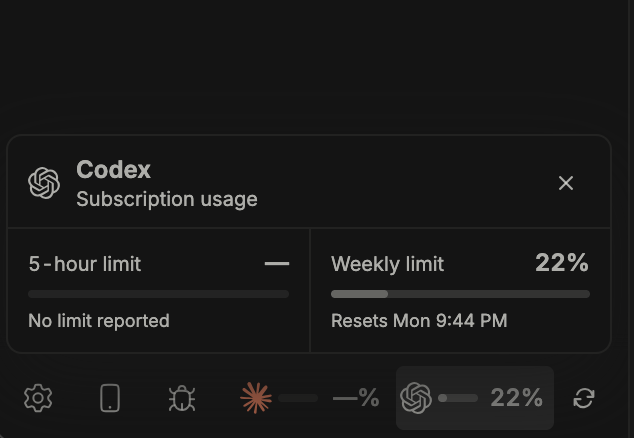

<p align="center">
  
</p>

<h1 align="center">Usage Tracker for BB</h1>

<p align="center">
  Codex and Claude Code limits, always visible in BB's sidebar footer.
</p>

> Fork of [MateoCerquetella/bb-plugins](https://github.com/MateoCerquetella/bb-plugins) `usage-tracker` (MIT) with
> model-scoped quota rows, so a Fable limit shows next to the 5-hour and weekly
> limits in the expanded Claude Code card.

Usage Tracker adds one compact, live strip beside BB's existing sidebar
utility icons. Claude Code and Codex each show a progress bar and their current
usage reading, without adding a navigation item or a separate plugin page.



## Features

- Shows Codex and Claude Code subscription usage in BB's sidebar footer.
- Lets you show or hide Codex and Claude Code independently; the strip
  compacts for one provider and disappears when both are disabled.
- Expands either provider to show its five-hour and weekly percentages.
- Projects each window forward to its reset time and marks it on track,
  watch, or at risk, in the strip and in the expanded view.
- Includes reset timing and provider session status in the expanded view.
- Refreshes automatically every five minutes and whenever a stale BB window
  becomes active again.
- Provides a manual refresh button for both providers.
- Preserves last-known limit windows through temporary errors, expired
  sessions, and rate limits.
- Cleans up its UI on plugin reload, disable, or removal and works alongside a
  custom thread list such as t3sidebar.

## Install

Usage Tracker requires BB 0.38 or newer. Install from the `hmps` marketplace:

```sh
bb marketplace add git:https://github.com/hmps/bb-plugins.git@main
bb plugin install usage-tracker@hmps
```

The strip appears in the bottom of the sidebar as soon as the plugin loads.
Both providers are enabled by default. Change them independently under
**Settings → Plugins → Usage Tracker**.

The provider CLIs must be installed and signed in for BB to report their usage:

```sh
codex login
claude
```

If a CLI is missing, signed out, or expired, expand that provider in the strip
to see the recovery instruction reported by BB.

## Use

The collapsed strip is designed for quick scanning:

- Select the Claude Code or Codex reading to open its details in place.
- Review the full **5-hour limit**, **weekly limit**, and their reset times.
- Read the pace line under each window, for example
  `At risk · ~130% at reset · runs out Thu 14:00`. The tick in the bar shows
  how much of the window has already elapsed. A provider reading turns amber
  or red when one of its windows needs attention.
- Select the same provider again, use the close button, press <kbd>Esc</kbd>,
  or click outside the details to collapse it.
- Select the refresh icon to fetch both providers immediately.

Usage Tracker otherwise refreshes in the background every five minutes. It
also refreshes when the window regains focus or becomes visible after the last
successful fetch has become stale.

## Update or remove

Check for updates and install the latest compatible release with BB:

```sh
bb plugin outdated
bb plugin update usage-tracker
```

Remove it with:

```sh
bb plugin remove usage-tracker
```

## Data and privacy

The plugin reads BB's local `system.usageLimits` data and does not ask for or
store provider credentials. Its only persistent browser data is the last
successful usage snapshot in local storage, used to keep useful values visible
during a temporary provider or network failure.

Usage Tracker runs as a trusted BB frontend content script. Install plugins
only from sources you trust.

## Develop

```sh
cd plugins/usage-tracker
npm install
npm run check
```

## Links

- [Upstream source](https://github.com/MateoCerquetella/bb-plugins)
- [MIT license](./LICENSE)
